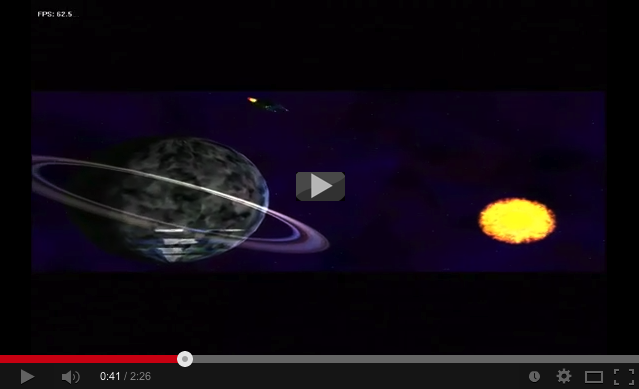

This Gravity The Revolution, an ancient game that I developed together with friends at highschool. 
It is written in Visual Basic 6 ;-) and DirectX7 (Those were the days...). The game's source code
is probably not the most beautiful anymore, but this was our first real project.

The game's features:

  - 5 different space ships with different capabilities
  - 2d and 3d effects using DirectDraw and Direct3d
  - Network mode with arbitrary amount of players
  - AI for bots in single player mode
  - 3 different weapons
  - 3d light effects
  - completely destructible level
  - map editor
  - weapon editor
  - ship editor
  - custom UI for menu and in game HUD
  - in game command terminal for developers and "power users" ;-)
  - particle effects for weapons and explosions

A 3d video with the credits:

